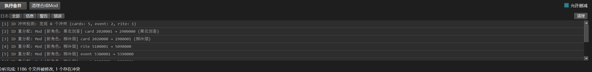
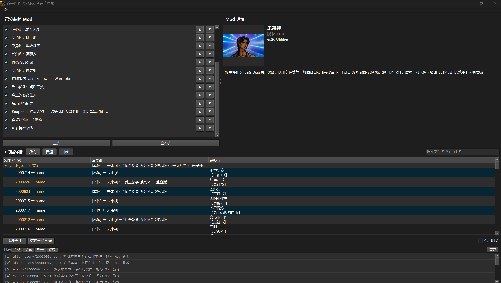
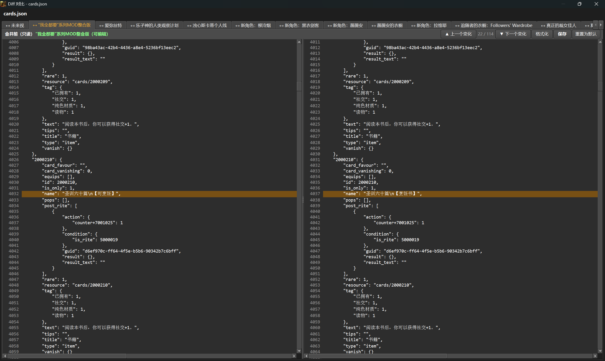
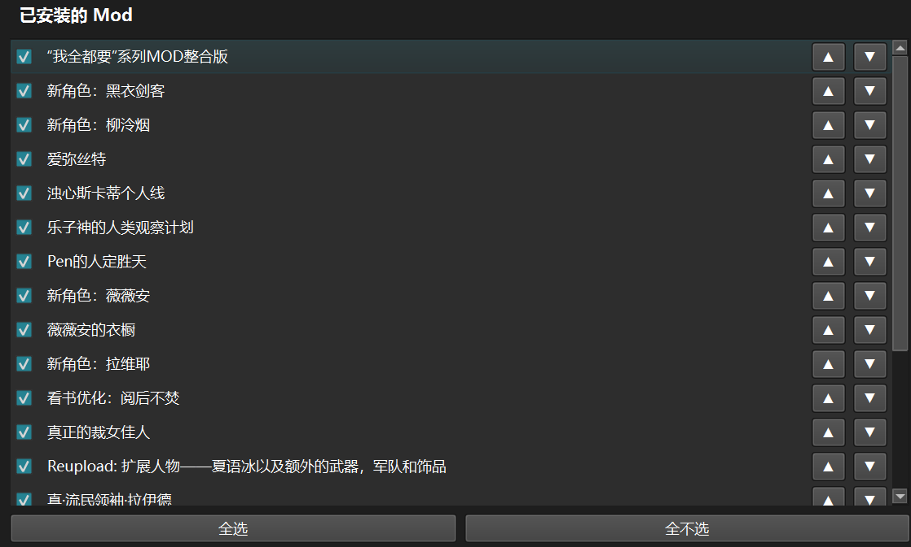
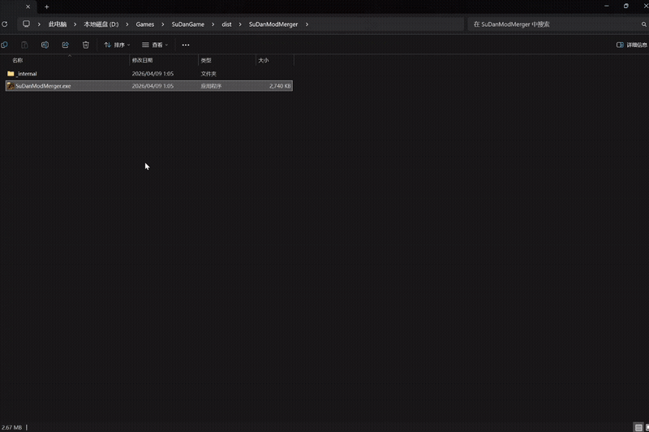

# 苏丹的游戏 - Mod 合并管理器

玩「苏丹的游戏」下了好几个 Mod，结果发现有两个 Mod 都改了同一个文件，游戏直接报错冲突，禁止同时开启，这种情况屡见不鲜。但其实大部分mod之间其实并没有真正修改到同一数据，造成完全不可避免的冲突，但是游戏还是给你报错了，你肯定想过为什么自己不能全都要呢？如果你这样想，那这个工具就很适合你。

目前这个工具就是来解决这个问题的。它不是简单地用一个文件替换另一个，而是把多个 Mod 的修改内容在 JSON 字段级别做深度合并，生成一个「合成 Mod」。这样所有 Mod 的改动都能共存，你不用再纠结该留哪个。

**我全都要！**

> 本项目大部分代码通过 AI 辅助编程（vibe coding）实现。

## 功能特性

### 1. ID 冲突自动处理

不同 Mod 作者之间没有沟通，可能碰巧用了相同的 ID。比如两个 Mod 都新建了一张 ID 为 5000101 的卡牌，直接合并会出问题。

工具会自动检测这种冲突，给低优先级的 Mod 重新分配一个不冲突的 ID，并且自动把所有引用这个 ID 的地方一起改掉。你不需要手动处理任何 ID 问题。


### 2. 智能合并 + 冲突定位

工具会深入到 JSON 文件内部，逐个字段地进行合并。大多数情况下合并是全自动的——两个 Mod 改了不同的字段，各取所需就好。

但如果两个 Mod 恰好修改了同一个字段（真正的冲突），工具会用醒目的颜色标注出来。你可以在内置的 Diff 对比面板里清楚地看到每个 Mod 改了什么，还能直接手动编辑合并结果。




### 3. Mod 优先级排序

你可以通过拖拽或上下按钮调整 Mod 的优先级。排在下面的 Mod 优先级更高——当多个 Mod 修改了同一个字段时，优先级高的那个值会被保留。


## 安装

### 方式一：下载 exe

从 [GitHub Releases](../../releases) 下载最新版 `SuDanModMerger.zip`，解压后直接运行 `SuDanModMerger.exe`，无需安装 Python。

### 方式二：从源码运行

需要 Python 3.10+：

```bash
pip install -r requirements.txt
python -m src.main
```

或者双击 `run.bat`。

## 使用指南

自动查找创意工坊、游戏mod目录（~\Documents\DoubleCross\SultansGame\Mod） 下多个不同mod合并为整合mod。

1. **首次启动**会自动生成合并规则文件（需要几秒钟，只跑一次）
2. 工具自动扫描已安装的 Mod 并列出
3. **勾选**要启用的 Mod，**拖拽**或用 ▲▼ 按钮调整优先级（下方优先级更高）
4. 工具**自动分析**哪些文件被多个 Mod 修改，以及具体的冲突情况
5. **双击**覆盖详情中的文件，打开 Diff 对比面板查看每个 Mod 的修改细节
6. 点击「**执行合并**」生成合成 Mod
7. 在游戏中**禁用所有原始 Mod**，只启用合成 Mod 即可



## 注意事项

- 游戏更新后建议重新执行合并，以获取本体新增的内容
- Mod 优先级：列表中越靠下的 Mod 优先级越高，同一字段以最后一个 Mod 的值为准
- 首次使用需要在「文件」菜单中设置正确的游戏路径和 Workshop 路径

---

## English Summary

**Sultan's Game - Mod Merge Manager**

You've downloaded a bunch of mods for Sultan's Game, only to find that two of them modify the same file — and the game throws a conflict error, refusing to enable both at once. Sound familiar? In most cases, the mods aren't even touching the same data — there's no real conflict — but the game blocks them anyway. Ever wished you could just have them all? If so, this tool is for you.

It performs **deep field-level JSON merging** across multiple mods, producing a single synthetic mod that preserves all changes. No more choosing one mod over another.

**I want it all!**

> Most of the code in this project was written with AI-assisted programming (vibe coding).

**Key Features:**

- **Automatic ID conflict resolution** — Detects when different mods use the same entity ID (cards, rites, events, etc.) and automatically reassigns conflicting IDs with all references updated.
- **Smart merging with conflict highlighting** — Merges mods at the JSON field level rather than file level. True conflicts (same field modified by multiple mods) are highlighted in an interactive diff panel where you can review and manually adjust the merged result.
- **Drag-and-drop priority ordering** — Arrange mod priority by dragging. Lower position = higher priority. When conflicts occur, the highest-priority mod's value wins.

**Installation:**

- **Recommended:** Download the latest `SuDanModMerger.zip` from [GitHub Releases](../../releases) and run `SuDanModMerger.exe`.
- **From source:** Requires Python 3.10+. Run `pip install -r requirements.txt`, then `python -m src.main`.

**Usage:** Launch the tool → select and order your mods → click "Execute Merge" → disable all original mods in-game and enable only the synthetic mod.
